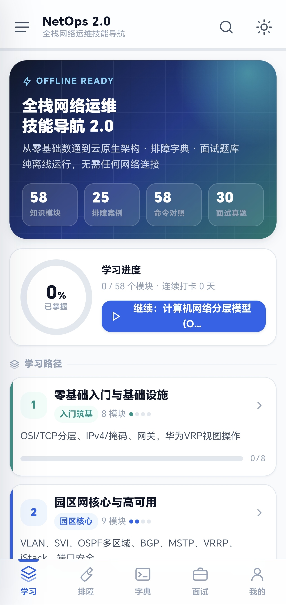
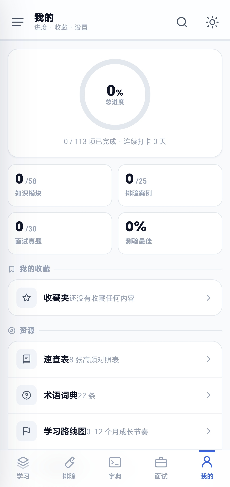

# NetOps 2.0 — 全栈网络运维技能导航

> 从零基础数通到云原生架构，把整个网络运维知识体系装进口袋。**完全离线，无需任何网络连接。**

[](https://github.com/7SteveJohn/netops-handbook/releases/tag/v2.0.3)
[](#)
[](https://github.com/7SteveJohn/netops-handbook/releases/tag/v2.0.3)

---

## 它是什么

NetOps 2.0 是一个为零基础萌新打造的 **Android 离线网络运维学习 App**。

打开即用，不联网、不注册、不看广告。所有内容——58 个知识模块、25 个排障案例、58 条多厂商命令对照、30 道面试真题、500+ 条 CLI 模拟器命令、14 张内置壁纸——全部打包在安装包里，断网也能学。

适合这些场景：

- 🏗 机房割接现场，没网也能查命令
- 📝 面试突击复习，通勤路上刷题
- 🎯 按路线图系统学习，从零基础到架构师
- 🔧 现场排障速查，秒找对应命令和思路

## 一图看懂

| | |
|---|---|
| **首页 — 学习路径与进度总览** |  |
| **学习路线图 — 0-12 月成长节奏** |  |
| **我的 — 进度 / 收藏 / 资源入口** |  |

## 五大功能

### 📚 学习 — 58 个知识模块

按阶段组织的学习路径，从 OSI 七层模型一路走到云原生 SRE：

1. **零基础入门与基础设施**（8 模块）— OSI/TCP 分层、IPv4/掩码计算、网关原理、华为 VRP 视图操作
2. **园区网核心与高可用**（9 模块）— VLAN / Trunk / SVI、OSPF 多区域、BGP、MSTP / VRRP / iStack 堆叠
3. **广域网与安全** — NAT / PPPoE / MPLS、防火墙策略、802.1X、无线 AC-AP
4. **云原生网络转型** — VXLAN / EVPN、K8s CNI、Calico / Cilium / eBPF、可观测性三支柱
5. **架构与 SRE** — SLI / SLO / 错误预算、混沌工程、GitOps 闭环、跨数据中心高可用

每个模块点进去就是完整的内容页，支持收藏和进度标记。

### 🔧 排障 — 25 个真实场景

典型故障的「现象 → 分析 → 命令」三段式卡片：

- 链路不通怎么排查？从物理层到路由逐层定位
- 隧道 MSS 导致大包丢包？`tcp adjust-mss` 一行搞定
- STP 风暴 / MAC 地址漂移 / OSPF 邻居起不来……每个都有对应的急救命令

### 📖 字典 — 58 条多厂商命令对照

同一功能，华为 / Cisco / 中兴 / Linux 四家命令并排显示：

```
示例：Trunk 放行 VLAN
  华为: port trunk allow-pass vlan 10
  Cisco: switchport trunk allowed vlan 10
  中兴: port trunk permit vlan 10
  Linux: -
```

还收录了高频巡检命令（BGP 邻居汇总、路由表查看、接口简要状态等）。

### 💻 CLI 终端模拟器 — 500+ 条命令

内置离线终端模拟器，贴近真实设备操作体验：

- **500+ 条命令**：华为 VRP / Cisco IOS / 中兴 / Linux / K8s 五平台
- **智能匹配**：精确匹配 → 前缀联想 → 模糊近似建议；输入 `display` 自动列出全部 `display` 开头的命令
- **分组帮助**：`help` 按平台/功能分组展示常用命令示例
- **历史持久化**：命令历史存本地，上下方向键翻看，重开 App 自动恢复
- **平台切换**：`mode hw|cs|zte|lx` 随时切换设备类型，提示符跟随变化

### 📝 面试 — 30 道真题

从概念题到架构设计题，覆盖各层次：

- 「Hybrid 接口和 Access / Trunk 的区别？」
- 「OSPF 的 LSA 类型有哪些？Type 7 是什么？」
- 「iptables 规则多了性能会怎样？是 O(n) 还是指数级？」
- 「公有云里 Calico 为什么不能直接跑 BGP？」

每道题带解析，帮你在面试前快速过一遍关键知识点。

### 👤 我的 — 进度追踪与资源

- **总进度圆环**：已掌握 / 总项数百分比
- **分项统计**：知识模块、排障案例、面试真题各自完成度
- **收藏夹**：把常看的模块或命令一键收藏
- **资源入口**：速查表（8 张高频对照表）、术语词典（22 条）、学习路线图
- **内置壁纸**：14 张精选壁纸（二次元 / 芙宁娜 / 今汐 / 卡提希娅 / 雷电将军 / 纳西妲 / 守岸人），或从相册自选，壁纸模式下内容层半透明
- **个性化质感**：液态玻璃（通透度 10-95% 可调）/ 标准毛玻璃 / 高斯模糊三种全局质感
- **数据备份**：进度 / 收藏 / 测验成绩一键导出 JSON，换机可导入恢复

## 使用方式

1. **下载安装** → [Releases 页面](https://github.com/7SteveJohn/netops-handbook/releases/tag/v2.0.2) 下载 `app-release.apk`，允许「未知来源」安装即可
2. **打开即用** → 底部五个 Tab 切换：**学习 / 排障 / 字典 / 面试 / 我的**
3. **搜索** → 右上角 🔍 图标全局搜索任意关键词
4. **深色模式** → 右上角 ☀️ 图标切换明暗主题
5. **学习页左滑** → 任意位置向左滑呼出目录，再向右滑关闭（其他页面不受影响）
6. **返回导航** → Android 物理返回键逐层回退，到根页可退出

> **注意**：本应用**不申请任何权限**——没有网络，没有存储，没有震动。首次安装时系统可能提示「未知的开发者」，这是正常的安全提示，选择「仍然安装」即可。

## 内容一览

| 类别 | 数量 | 示例 |
|------|------|------|
| 知识模块 | 58 | OSI 分层、VLAN/Trunk、OSPF 多区域、BGP 选路、VXLAN/EVPN、eBPF、GitOps… |
| 排障案例 | 25 | 链路不通、MSS 过小丢包、STP 风暴、MAC 漂移、OSPF 邻居异常… |
| 命令对照 | 58 | Trunk 放行、端口描述、VLAN 创建、OSPF 邻居、BGP 汇总、接口状态… |
| 面试真题 | 30 | Hybrid vs Trunk、LSA 类型、iptables 复杂度、Calico 云端限制… |
| 速查表 | 8 张 | 高频命令对照表（按场景分类） |
| 术语词典 | 22 条 | 核心网络运维术语的定义与辨析 |

## 技术细节

- **纯离线**：零权限声明，零外部请求，所有内容与美术资源（SVG/CSS）内联打包
- **移动优化**：安全区域适配（刘海屏/挖孔屏）、边到边沉浸界面、输入法弹出时标签栏自动让位、左缘抽屉手势与系统返回手势互不打架、冷启动不闪白
- **单文件 SPA**：全部前端代码打包为一个 `index.html`，通过 Android WebView 加载
- **开源协议**：MIT License

## 更新日志

### v2.0.3 · 玻璃三模式 + 手势返回 + 退出确认

质感三模式终于统一了：

- **液态玻璃**：背景透明，看得到壁纸。通透度滑块（10-95%）联动所有内容组件——主卡、子段、列表、统计、阶段全模块响应，不再"只能看见底栏在变"。
- **毛玻璃（frosted）**：实色暖白磨砂 + 背景模糊跟随 px 滑块（8-20px）。朦胧感统一，不再"有时模糊有时色块"。
- **高斯模糊（gaussian）**：近不透明 + 轻模糊，省电档。和毛玻璃同套 px 滑块。
- **Android WebView 降级检测**：检测到 WebView 或低版本 Chrome 时，自动禁用 backdrop-filter 改用高 alpha 实色蒙版（0.85）——修复之前 Android 上"滚动白雾闪/色块/蒙版消失"。

手势与返回彻底打通：

- **左滑手势全页面生效**：二级菜单左滑=返回上一级，学习页根界面左滑=呼出目录。非学习模块左滑也响应。
- **退出二次确认**：根界面触发返回时弹 Toast「再按一次退出应用」，2 秒内再次才真正退出——物理返回键和网页手势行为一致。
- **NetOpsBack 统一 `handleBackOrExit`**：首次拦截返回 `true` 阻止原生退出，二次返回 `false` 才放行——之前原生返回键绕过确认直接退出的 bug 修复。
- **Home 回桌面重进修复**：boot() 防重复绑定、visibilitychange + focus 重置退出计时——之前回桌面重进后手势失效的问题根治。

内容与稳定性：

- **GPU 合成层提升排除 sheet/drawer/appbar/tabbar**（它们已有自己的 slide transform）——之前 GPU 提升覆盖 slide 动画导致 sheet/drawer 卡死的 bug 修复
- **壁纸下二级子段统一蒙版**（液体=透明 / 毛玻璃=高 alpha 实色 + 模糊 / 高斯=近不透明），不再"抠图"或"白雾闪"
- **截图中屏幕与壁纸**两套视觉语言统一

### v2.0.2 · 壁纸与个性化

加了 14 张内置壁纸，二次元、芙宁娜、今汐等各两张，可以直接选，也可以从相册自己挑。选了背景壁纸之后，卡片自动半透明，能透出壁纸来。

质感这次重做了。液态玻璃改成调「通透度」（10-95%），毛玻璃和高斯还是调模糊强度（8-20px）——不同模式各有各的滑块，不会互相挤占。悬浮胶囊在滚动时也能保持通透，不会突然变模糊。

CLI 模拟器终于像样了。命令从原来 200 多条扩到 500 多条，前缀能联想、help 按平台分组、历史自动存。命令库用空闲回调异步构建，不卡首屏。

内容动了真格。翻了一轮勘误：MPLS、VXLAN、SNMPv3、SSH 这些原来抄错或者不完整的命令都修了；OSPF 网络类型、BGP 路由反射器、VRRP Track、K8s Service 这些高频考点之前漏的补上了；更深一点加了 RA/SLAAC、6to4 vs NAT64、Ambient Mesh、eBPF CO-RE 这些进阶内容；该标 RFC 的都标了（OSPF/BGP/VRRP/IPv6/EVPN/SRv6）。

数据终于能备份了。我的页加了「导出数据备份」和「导入数据恢复」，进度、收藏、测验成绩打包成 JSON，换机能找回来。

学习页手势改了。任意位置左滑呼出目录，右滑关掉，对称手势——之前边缘右滑会撞 Android 系统返回，现在避开那块，不影响别的地方。第一次进学习页有提示。

### v2.0.1 · 离线优化
- **零权限**：移除振动权限，App 不申请任何系统权限
- **平板友好**：取消强制竖屏，平板横屏学习体验更佳；旋转不再丢失进度
- **键盘不再遮挡**：搜索框 / CLI 输入时，底部导航与悬浮按钮自动让位，输入区始终在视野内
- **手势更顺**：左侧抽屉与 Android 系统侧滑返回不再冲突
- **启动无闪白**：冷启动按上次主题着色
- **触感反馈**：震动改走系统 API，跟随系统开关
- **CLI 体验**：终端输出随键盘自动滚底
- **导航修正**：切底部标签回到顶部，不再误滚到上次位置

### v2.0.0 · 首发
- 初始版本：58 知识模块 / 25 排障案例 / 58 条命令对照 / 30 道面试题，完全离线

## 下载

📥 [**v2.0.3 Release（含 APK）**](https://github.com/7SteveJohn/netops-handbook/releases/tag/v2.0.3)

## 许可

本项目以 MIT License 开源。内容仅供学习交流。
