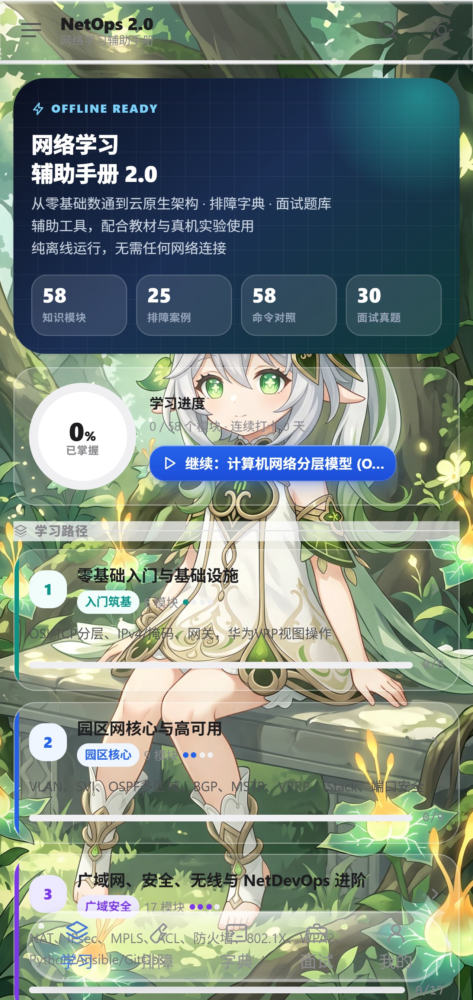
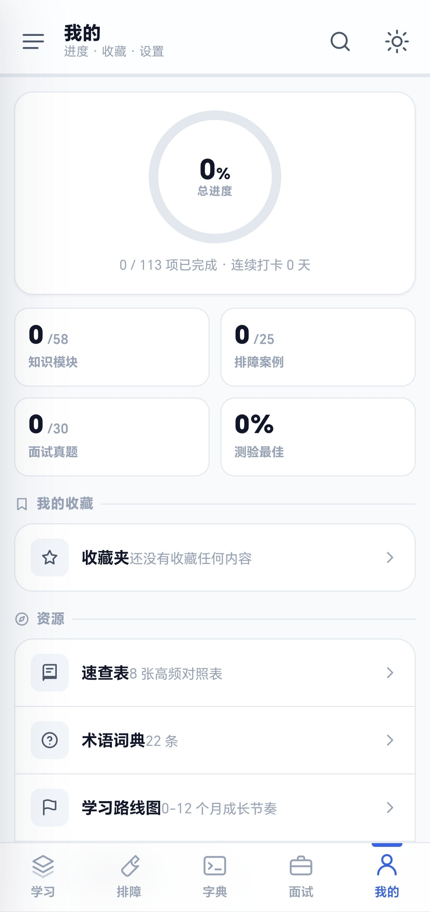

# NetOps 2.0 — 网络学习辅助手册

> 从零基础数通到云原生架构，把网络知识体系装进口袋随身查。**完全离线，无需任何网络连接。**
>
> 先说清楚定位：它是**辅助工具**，得配着教材、网课和真机实验一起用，不是一门能独立走完的课。

[](https://github.com/7SteveJohn/netops-handbook/releases/tag/v2.0.5)
[](#)
[](https://github.com/7SteveJohn/netops-handbook/releases/tag/v2.0.5)

> **🤖 AI 助手 / 维护者入口**：改代码前先读 [AGENTS.md](./AGENTS.md)（项目须知与硬约束）。

---

## 它是什么

NetOps 2.0 是一个为零基础萌新做的 **Android 离线网络学习辅助 App**。

打开即用，不联网、不注册、不看广告。所有内容——68 个知识模块、35 个排障案例、58 条多厂商命令对照、53 道面试真题、431 条 CLI 模拟器命令、14 张内置壁纸——全部打包在安装包里，断网也能查。

适合这些场景：

- 🏗 机房割接现场，没网也能查命令
- 📝 面试突击复习，通勤路上刷题
- 📖 上课学网络时当随身字典，课前预习、课后查漏
- 🎯 对着教材和实验看路线图，知道自己在学哪一块
- 🔧 现场排障速查，秒找对应命令和思路

不适合：指望只翻它就把网络学会。系统学习还得靠教材、课程和真机练习。

## 一图看懂

| | |
|---|---|
| **首页 — 学习路径与进度总览** |  |
| **学习路线图 — 0-12 月成长节奏** |  |
| **我的 — 进度 / 收藏 / 资源入口** |  |

## 五大功能

### 📚 学习 — 68 个知识模块

按阶段组织的学习路径，从 OSI 七层模型一路走到云原生 SRE：

1. **零基础入门与基础设施**（12 模块）— OSI/TCP 分层、IPv4/掩码与网关、ARP、ICMP 与 ping/tracert、TCP/UDP 与三次握手、DHCP、华为 VRP 视图与配置管理
2. **园区网核心与高可用**（11 模块）— 静态路由与最长匹配、VLAN / Trunk / SVI、STP / RSTP 端口角色、OSPF 多区域与 LSA、BGP 属性选路、MSTP / VRRP / iStack / Eth-Trunk
3. **广域网、安全与自动化**（17 模块）— NAT / PPPoE / MPLS L3VPN、ACL 与防火墙 Zone、IPsec、802.1X、无线 AC-AP 与 802.11r 漫游、Netmiko / Ansible / Git / GitOps
4. **云原生与 SRE**（26 模块）— VXLAN / EVPN、IPv6、BGP unnumbered（v4 走 v6 下一跳）、SNMP 与 gNMI/YANG 流式遥测、Prometheus / Syslog、K8s CNI / Calico / NetworkPolicy / Ingress 选型 / Gateway API / CoreDNS、eBPF、混沌工程、SLI / SLO / 错误预算

每个模块点进去就是完整的内容页，支持收藏和进度标记。

### 🔧 排障 — 35 个真实场景

典型故障的「现象 → 分析 → 命令」三段式卡片：

- 链路不通怎么排查？从物理层到路由逐层定位
- 隧道 MSS 导致大包丢包？`tcp adjust-mss` 一行搞定
- STP 风暴 / MAC 地址漂移 / OSPF 邻居起不来……每个都有对应的急救命令

### 📖 字典 — 58 条多厂商命令对照

同一功能，华为 / Cisco / 中兴 / Linux 四家命令并排显示：

```
示例：Trunk 放行 VLAN
  华为: port trunk allow-pass vlan 10
  Cisco: switchport trunk allowed vlan 10
  中兴: port trunk permit vlan 10
  Linux: -
```

还收录了高频巡检命令（BGP 邻居汇总、路由表查看、接口简要状态等）。

### 💻 CLI 终端模拟器 — 431 条命令

内置离线终端模拟器，贴近真实设备操作体验：

- **431 条命令**：华为 VRP / Cisco IOS / 中兴 / Linux / K8s 五平台
- **智能匹配**：精确匹配 → 前缀联想 → 模糊近似建议；输入 `display` 自动列出全部 `display` 开头的命令
- **分组帮助**：`help` 按平台/功能分组展示常用命令示例
- **历史持久化**：命令历史存本地，上下方向键翻看，重开 App 自动恢复
- **平台切换**：`mode hw|cs|zte|lx` 随时切换设备类型，提示符跟随变化

### 📝 面试 — 53 道真题

从概念题到架构设计题，覆盖各层次：

- 「Hybrid 接口和 Access / Trunk 的区别？」
- 「OSPF 的 LSA 类型有哪些？Type 7 是什么？」
- 「iptables 规则多了性能会怎样？是 O(n) 还是指数级？」
- 「公有云里 Calico 为什么不能直接跑 BGP？」

每道题带解析和 STAR 拆解（S/T/A/R 各说哪一句、落点在哪里），帮你在面试前快速过一遍关键知识点。

### 👤 我的 — 进度追踪与资源

- **总进度圆环**：已掌握 / 总项数百分比
- **分项统计**：知识模块、排障案例、面试真题各自完成度
- **收藏夹**：把常看的模块或命令一键收藏
- **模拟测验**：72 道选择题，随机抽 10 题、答完判分、记历史最佳与连击
- **错题本**：答错的题自动留下，每题带「回看这张卡」锚点，一键跳回对应模块并展开；再练时做对一次即自动移出错题本（本地持久化，重启不丢）
- **资源入口**：速查表（12 张高频对照表）、术语词典（48 条）、学习路线图
- **内置壁纸**：14 张精选壁纸（二次元 / 芙宁娜 / 今汐 / 卡提希娅 / 雷电将军 / 纳西妲 / 守岸人），或从相册自选，壁纸模式下内容层半透明
- **个性化质感**：液态玻璃（通透度 10-95% 可调）/ 标准毛玻璃 / 高斯模糊三种全局质感
- **数据备份**：进度 / 收藏 / 测验成绩一键导出 JSON，换机可导入恢复

## 使用方式

1. **下载安装** → [Releases 页面](https://github.com/7SteveJohn/netops-handbook/releases/tag/v2.0.5) 下载 `app-release.apk`，允许「未知来源」安装即可
2. **打开即用** → 底部五个 Tab 切换：**学习 / 排障 / 字典 / 面试 / 我的**
3. **搜索** → 右上角 🔍 图标全局搜索任意关键词
4. **深色模式** → 右上角 ☀️ 图标切换明暗主题
5. **左缘右滑** → 屏幕左缘向右滑即返回上一层（等同返回键，页面内横向滚动不受影响）
6. **返回导航** → Android 物理返回键逐层回退，到根页可退出

> **注意**：本应用**不申请任何权限**——没有网络，没有存储，没有震动。首次安装时系统可能提示「未知的开发者」，这是正常的安全提示，选择「仍然安装」即可。

## 内容一览

| 类别 | 数量 | 示例 |
|------|------|------|
| 知识模块 | 68 | OSI 分层、ARP/ICMP/TCP/DHCP、静态路由、VLAN/Trunk、STP/RSTP、OSPF/BGP、VXLAN/EVPN、gNMI 遥测、eBPF、GitOps… |
| 排障案例 | 35 | 链路不通、MSS 过小丢包、STP 风暴、MAC 漂移、OSPF 邻居异常… |
| 命令对照 | 58 | Trunk 放行、端口描述、VLAN 创建、OSPF 邻居、BGP 汇总、接口状态… |
| 面试真题 | 53 | Hybrid vs Trunk、LSA 类型、iptables 复杂度、Calico 云端限制…（全部含 STAR 拆解） |
| 模拟测验 | 72 题 | 按阶段抽 10 题、答完自动判分、记历史最佳与连击；新增题覆盖 ARP/TCP/DHCP/静态路由/STP/遥测/BGP unnumbered |
| 速查表 | 12 张 | 高频命令对照表（按场景分类） |
| 术语词典 | 48 条 | 核心网络运维术语的定义与辨析 |

## 技术细节

- **纯离线**：零权限声明，零外部请求，所有内容与美术资源（SVG/CSS）内联打包
- **移动优化**：安全区域适配（刘海屏/挖孔屏）、边到边沉浸界面、输入法弹出时标签栏自动让位、左缘抽屉手势与系统返回手势互不打架、冷启动不闪白
- **单文件 SPA**：全部前端代码打包为一个 `index.html`，通过 Android WebView 加载
- **开源协议**：MIT License

## 更新日志

### v2.0.5 · 返回键稳态 + 搜索交互收拢 + 构建水印

> 本轮核心：Android 返回链路三处竞态/错挂修复、搜索栏 ✕ 退场与搜索态三路收拢、
> 装机构建水印、smoke 回归扩至 95 条全绿。

**返回键稳态（Android 壳）**
- `enableOnBackInvokedCallback` 此前误挂在 `<activity>` 上被系统整体忽略，App 一直跑旧版返回派发；现挂到 `<application>`，Android 13+ 走系统统一派发，返回行为不变。
- 修「第一次打开就弹退出提示、之后确认机制消失」：冷启动网页未就绪时 500ms 超时按根页面处理，连按两下被误判成确认退出；现在应答窗口内的连按直接忽略。
- 二次返回退出改走 `finishAndRemoveTask`：不再依赖 androidx 兜底回退链，残留任务不会再让下次进入的退出确认错乱。
- 渲染进程被回收重建时，先按契约回掉挂起的文件选择器（恰好一次 null），选择结果不再喂给已销毁的 WebView；载入重试守卫捕获失败实例本身，防止过期重试命中新实例。
- 导出写盘、图片解码压缩等重 I/O 移到专用后台线程，主线程只留 Toast。

**搜索：叉号退场，状态不残留**
- 清空 ✕ 整体移除（三轮反馈定论：叉号一律会被误读为「关闭搜索」）。清空 = 退格键，清到空 = 退出搜索；退出 = 框外「取消」；桌面 Chrome 原生 ✕ 一并隐藏。
- 搜索态三路收拢：切 tab、同 tab 二次点击、点结果进内容，搜索栏都自动收起。
- 返回键先收搜索再走正常回退；收起态的搜索路由条目（僵尸页）被跳过，返回落点必是真实页面。
- 连续打卡断签归零：最后打卡既不是今天也不是昨天时显示 0（此前一直挂旧数字）。
- 打卡后抽屉分组计数即时刷新；移除「左滑呼出目录」残留提示（该手势 v2.0.4 已删，提示在教一个不存在的手势）。

**构建可核验**
- 「我的」页脚新增构建水印：装机一看便知跑的是哪一刻构建的包，旧 APK 与 devpage 顶替无所遁形。
- smoke 回归扩至 95 条全绿：返回键分支、搜索收拢三路、僵尸页跳穿、手势边界、断签归零、抽屉计数、错题本确认拦截。

### v2.0.4 · 玻璃扣干净 + 内容扩充与勘误 + 稳定性

> 本轮核心：全局嵌套色块清除（分节行/筹码行/底栏双重底）、药丸选中态推倒重构为纯 CSS 弹簧滑动、
> 左滑唤栏移除（左缘统一只做返回）、真机脚本报错与横幅安全区修复、
> 53 道面试 STAR 全覆盖 + 57+ 处事实勘误 + 68 模块扩充。

**玻璃不再露白色色块**
- 内层底板（表头与首列、chip、徽标、图标底板、进度轨、开关、通透度滑块、进度环内圆）过去吃的是纯白 `--surface`，容器半透明了它们仍是白块；现在统一由 `--surf-*` token 跟随通透度，实测 10% → 94% 全程联动。
- 真机 WebView 降级层原本把 23 个组件钉死成 `rgba(255,255,255,.85)`，滑块对它们无效；现在跟随当前质感档位（液态跟通透度，毛玻璃/高斯跟模糊强度）。
- 液态玻璃下的「二级子段」（`.sec`、普通 note、答题解析）此前恒为 .78 白纱，一并接入滑块。
- 修掉真机上进度圆环被实色蒙版压成实心白圆、弧线消失的问题。
- 弹窗保留 .55 的可读性下限：实测在暗色壁纸区域，正文对比度从 1.12:1 提到约 5.6:1（WCAG AA 需 4.5）。

**内容：58 → 68 个知识模块**
- 零基础补齐：ARP、ICMP 与 ping/tracert、TCP/UDP（三次握手、四次挥手、TIME_WAIT、重传）、DHCP 原理
- 园区网补齐：静态路由与默认路由（含 preference 口径与回程陷阱）、STP / RSTP 端口角色与收敛
- 与时俱进：gNMI 流式遥测与 NETCONF/YANG、BGP unnumbered（IPv4 路由走 IPv6 下一跳，RFC 8950）
- 53 道面试真题全部补上 STAR 拆解（此前只有 1 道有，但对外写着「30 个 STAR 卡」）
- 按权威源核对并修正 57+ 处事实与命令：EBGP multihop 与 TTL 的关系、OSPF DD 的 MTU 判据是单向的、
  BGP 选路顺序属厂商实现、VRRP 标准改指 RFC 9568、EVPN Type-5 补 RFC 9136、TIME_WAIT 的 2MSL 定义、
  kube-proxy / IPVS / nftables 的现状与弃用时间表、Cilium 的内核与 BTF 要求、socket-LB 的真实机制、
  Gateway API 的 GA 现状与 **ingress-nginx 退役**、CoreDNS 的 search 域与 ndots:5、
  多条中兴与 Linux 列的命令真伪（含 `show mpls lsp` 其实是 Juniper 语法这类串台）
- 第二批六路复核再修 75 处字段级内容，逐条对着厂商命令参考与 RFC 原文改：VRP **根本没有 `lacp mode`**
  这条命令（华为与 H3C 的聚合命令此前被写反）、`option 43` 属 IP 地址池视图且 `sub-option` 决定编码、
  `dot11r` 在 ssid-profile 而非 sec-profile、`stp bpdu-protection` 不带 `enable`、MST 域改完必须
  `active region-configuration`、防火墙规则视图提示符按 rule 名拼接、SNMPv3 加密是分档可选、
  NetworkPolicy 匹配不了 ICMP、OSPFv3 的 Router-ID 与地址族属厂商/RFC 5838 差异
- 取不到一手原文的具体数值与「设备逐字回显」全部降级为「示意 / 以设备 ? 为准」，没有替换成新的编造文本；
  速查表补上 408、429、TCP 挥手中间态、RFC 1918 三行的口径，以及 NETCONF 830、gNMI 9339、MLAG 4334，
  并纠正 6443 的归属（IANA 登记的是 `sun-sr-https`，K8s 只是复用端口号）
- CLI 命令库判定规则收口：`小写键: 值` 这类 YAML 行不再被当成可敲命令（此前虚增 22 条）。
  命令数先由 411 回落到真实的 389，再因补齐缺步骤（策略路由的 `traffic-policy … inbound`、OSPF 的
  `area 0`、DHCP 地址池整链）与字典表新补的 8 个 Linux 格先升到 409，再因阶段一/二两张综合实验卡的
  命令入表，最终 431 —— 构建期复算与 App 运行时自报完全一致（实测 431 = 431），数字不再靠人记
- 内容厚度：34 个模块的原理正文补写完毕，最短的一档从 30~60 字提到 330 字量级 —— 全库原理正文
  中位数 333 字、合计 19,499 字，<60 字的模块已归零；补的都是机制与判据，没有为凑字数塞数值
- 命令对照表补 8 个 Linux 格（iproute2 / bridge / FRR / keepalived 真实语法），并在字典卡上写清
  `-` 的含义：该平台没有这个概念、或没取到可信命令，不是漏填

**面试库：30 → 53 题，新增 6 个维度**
- 原来 30 题里 HR 软技能 7、云原生 8、自动化 7，而本应用主体的数通架构只有 5、排障思路只有 3；
  现在补齐为：安全与零信任 4、园区与无线 3、稳定性工程 3、云网络与成本 2、算力与AI 2、面试形式 4（白板全链路、上机实操、反问环节、被问住了怎么办），
  并把数通架构提到 9、排障思路提到 4（分类不再靠关键词猜，数据里显式声明，关键词只兜底）。
- 与时俱进的部分：AI/LLM 在工作里的使用边界（几乎必问）、GPU 集群的无损与大带宽、零信任与 SASE 落地、
  云上 CNI 封装与路由配额、出流量与采集成本、告警分级与值班可持续性、变更评审与可执行回滚、白板全链路题。
- 个性化：每张技术面试题带 rel 关联模块；面试页可选「目标岗位」（数通/云原生/SRE/安全/自动化），
  相关性只由两件事决定：「你在关联模块上错过题」与「与目标岗位维度相关」，未标掌握的模块只做同分排序；
  另提供「与你相关 N」筛选。只改顺序与标注，「全部」永远能看完整 53 题，不藏题。

**备份范围：个性化设置并入 JSON 备份**
- 此前「导出数据备份」只取带 netops2. 前缀的学习数据，而玻璃参数（开关/质感/通透度/模糊强度）、
  标签栏形态、漫游速度档、壁纸选择、CLI 历史这 5 类存在非前缀的裸键里 —— 备份会静默漏掉它们。
  现在导出会一并取出，导入时逐项验形（非法项计入忽略数并跳过），恢复前的可回滚快照同样覆盖这些裸键。
- 唯一例外是**自选壁纸的图片本体**（最大约 1.8 MB 的 dataURL）：文本备份不该被图片撑爆，所以备份里只记
  「当前用的是自定义壁纸」，恢复后明确提示需要重选一次；壁纸逻辑本身自愈为无壁纸，而不是留一张坏引用。
- 入口文案改为如实描述范围；备份内容组装抽成 buildBackup()，冒烟测试可直接断言其内容。
- 端到端实测（真实引擎）：造好 5 类个性化 + 3 类学习数据 → 清空存储（模拟换机）→ 用备份文件导入 →
  进度、错题本、岗位画像、玻璃参数、标签栏形态、速度档、CLI 历史全部回来；JSON 中不含 data:image；
  壁纸按预期回到「无」并提示重选；快照正确记录了恢复前的空态。

**教学法：从「读完」到「做完】**
- 50 个模块的分步操作补成 3–5 步路径（动作 + 预期现象 + 对照实验），只有 1 步的模块清零；新增门禁要求知识模块与综合实验 ≥3 步、每步 ≤60 字，防止退回「一句话步骤」。
- 阶段一、阶段二各补一张综合实验卡（LAB1 小网开局到能上网、LAB2 园区网双核心高可用），四个阶段现在都有可完整做完的整活；四张实验卡的「实验」徽标终于真的渲染出来了（这段逻辑此前从未被触发）。
- 排障案例 25 → 35：把失衡的分类拉平（综合 1→4、overlay 1→2、无线 2→4、安全 3→4、二层 4→5、三层 7→9），每张都带「用什么证据证明是这一层」。
- 速查表 8 → 12 张（生成树角色与计时器、K8s 网络排障命令、EVPN 路由类型、指标与日志查询骨架），术语词典 22 → 48 条（PVID/BUM/ESI/RD-RT/NDP/DAD/PMTUD/MSL/CoA/PMF/BTF/CO-RE/EndpointSlice/燃尽率/头部与尾部采样/exemplar/反掩码/最长前缀匹配/状态检测/NAT-T-DPD/netem…）。
- 错题本闭环上线：72 道题全部补了模块锚点（`m` 字段），门禁会校验每个锚点指向真实卡片 —— 锚点断了就构建失败。判分后原地刷新错题本计数，不做整页重绘；题目指纹用题干哈希，题干一改旧错题自动失效，不会挂着错账。持久化经真实引擎验证：10 道错题刷新页面后仍在、清空后存储为 `{}`。
- 序列引导（取代「前置依赖提示」方案）：每张知识卡头部标出它在所属阶段里的位置（如 `3/12`），
  展开后底部给「上一张 / 下一张」，跨阶段时把目标阶段名一起标出（如「园区核心 · VLAN 接入类型」）。
  理由：搜索、收藏、错题锚点都会绕过阶段列表直接落到某一张卡，而依赖图需要人工策展且误标有害 ——
  实测启发式推导的精度只有约 50%，且 72 道题里只有 1 题的锚点会跨阶段，那个理由不成立。
  跳转复用错题本的 `data-jumpcard`，无新增存储、无新增门禁。
- 冒烟测试补上排障/面试/字典三类视图的逐卡展开：新增卡片此前只测阶段页，等于没测 —— 现在共 133 张卡逐张展开、零异常。

**平板与大屏（纯 CSS，前后都用同源 iframe 按真实媒体查询量过）**
- 标题栏与正文列对齐：≥900 时正文已到 860，标题栏仍停在 720，左边缘差 70px；现在两者同为 860、左边 210 一致。
- 底部胶囊不再横跨整屏：浮动栏改为与正文列同宽并居中（1280 下由 1232px 收到 860px，左边 370 与正文齐平）；
  tab 在格子里原本贴左，导致整组中心比视口中心偏左 56px，现在显式居中（1280 下 640 = 视口中心）。
- 中文正文行长压进可读区：宽屏下 `.note`/列表项限 42em（约 42 字/行，此前 828px ≈ 55 字/行），
  终端块与拓扑图保持满宽（792px / 772px）—— 可读性与代码可读性各取所需。
- 断点从 640 下调到 600：8" 平板竖屏与分屏常落在 600dp，此前整档跳到无上限布局，620–640 区间还会跳观感。
- 手机档回归：390×844 下页面、标题栏、胶囊、正文宽度与改动前一致，六个视口均无横向溢出。
- ≥1200 大横屏/桌面/DeX 改两栏卡片流：此前只有一列 860，1600 宽时两侧各空 370px。实测 1600×1200 下
  阶段页 13 张卡排成两列（列宽 568），展开的那张由 JS 打 `is-wide` 占满整行（终端块拿到 1112px 而非半列），
  排障页与面试页同样两栏；1024/800/390 仍是单列，六个视口均无横向溢出。
  没有依赖 `:has()` —— 老 WebView 不支持会静默降级，所以用一行 JS 标记。

**质感：把液态玻璃真的做成玻璃，并给文字设可读性下限**
- 先修一个「名存实亡」：降级判定以前是「UA 里有 wv 就全降」，把现代 WebView 一并打回平涂白板，
  而 liquid 模式又自己把 blur 设成 0（注释写"通透设计"）—— 真机上既没有模糊也没有高光。
  现在按能力探测降级（`CSS.supports('backdrop-filter')` + Chromium 版本下限），liquid 给回 18px 模糊。
- 模糊改成**单层预模糊背景**（`.wall`：壁纸铺一次、blur 一次，再 saturate 180% 与按主题压暗），
  滚动内容只叠半透明薄板、不再逐元素读 backdrop。逐元素 `backdrop-filter` 正是当初「滚动白雾闪」的根因，
  成本还随卡片数线性增长；`feDisplacementMap` 那套真折射在滚动界面上过不了 16ms/帧，没做。
- 实测出来的缺陷比"看着不美"严重：三级文字 `#86868b` 在 14 张内置壁纸上 **100% 面积低于 WCAG AA 的 4.5:1**，
  最差 1.00:1（等于隐形）；把它拉到纯白底上也只有 3.6:1 —— 这个 token 本来就够不到 AA。
  现在玻璃作用域内二/三级文字改 `#3c3c40`/`#55555a`（暗色 `#e6e6ea`/`#b9b9c2`），并按当前壁纸的亮度带
  **自动算出玻璃板不透明度下限**（明暗两套，0.46–0.92），通透度滑块拉到低于下限即被兜住。
- 最紧的一组（最亮壁纸 + 深色 + 通透度拉到底）真实引擎实测：说明文字 4.63:1、二级文字 7.25:1；
  修复前同一处是 1.00:1、且 100% 面积不达标。
- 新增「增强对比度」开关（四家厂商都有这一档）：目标从 AA 的 4.5:1 抬到长时间阅读的 7:1。
  只加厚玻璃到不了 7:1 —— 实测暗色下把 alpha 顶到 0.96 也只有 5.6:1，天花板是玻璃板自身的亮度；
  所以这一档同时换上更强对比的文字 token（浅色 `#2c2c30`、深色 `#e6e6ea`），必要时才再加厚。
  同一组最紧配置实测 10.29:1 / 7.25:1。
- 按压形变引擎（"QQ弹弹、按住能拉扯"那一下）：按住即整体压缩 2.5%，跟手位移上限 7px 并**沿拖动方向拉伸、
   垂直轴反向压缩**（面积近似守恒，看着才像软体），松手用弹簧过冲回位。只碰 transform，走合成层不触发布局；
   浏览器一旦接管滚动就收 pointercancel 顺势回位，绝不和滚动抢。作用于 tab / 筹码 / 按钮 / 列表行 / 阶段卡 /
   统计块 / 卡头 / 回顶按钮。必须用 `!important`：入场动画的 `fill:both` 优先级在普通内联样式之上。
   「动画效果 = 关闭」、系统要求减少动态效果、以及降级/低电量设备都不启用。
- 手感只能真机调，所以配了**设备内实时调参面板**：长按「全局质感」弹窗标题 0.6 秒展开（隐藏入口，不占正式界面），
   五个参数（跟手位移上限 / 按下压缩 / 沿拖动方向拉伸 / 垂直轴压缩 / 回弹时长）拨一下当场生效，
   面板里带一块可按住拉扯的演示，底部实时打印当前 JSON。数值存 `netops2.sqtune`，因此自动进 JSON 备份，
   导入时按"只收数值字段"验形、越界由 `getSqt()` 夹紧。冒烟新增一条端到端用例覆盖整条链路。
- 分节标签（「我的收藏」「资源」这类）原来整行戴着玻璃板却是零内边距零圆角，在深色壁纸上就是一条硬边色带 ——
   板子收到标签本身（`.sec__t` 胶囊），分隔线移到板外并渐隐收尾。
- 新增第六道门禁 `tools/audit-contrast.js`：14 张壁纸 × 明暗 × 二/三级文字复算对比度，任一组 <4.5:1 构建失败；
  换图没重新采样会被 sha1 哨兵拦下，求解器的压暗系数与 `--bg-bri` 不一致也会失败。
- 借厂商做法里最便宜的两味：内缘 30px 扩散白光（"厚玻璃"的主要线索，不用额外图层）、
  提饱和必须同时压暗背后（只 `saturate` 就是业界口中的"难看的灰玻璃"）。

**稳定性**
- 修掉一个真会白屏的缺陷：启动路径上有 6 处直接读 localStorage 未做兜底，存储不可用（file:// 源、
  隐私模式、配额耗尽）时首帧就抛异常 —— 现在全部走带 try 的读写，并新增第五道构建门禁，
  源码里再出现未兜底的 `localStorage.` 调用直接构建失败
- 离线冒烟套件本身是坏的（在 jsdom 里用了 file:// 源，全红），修好后逐视图、逐拓扑、返回栈、
  CLI 与搜索共 47 项全通过；两条过期断言改为按真实数据比对
- 内存压力下降级：系统回收内存时收掉离屏预栅格化缓冲（视口大小量级，约 10 MB/页）并让 WebView
  释放缓存，回前台自动恢复，不再靠系统直接杀渲染进程
- 物理返回键的「再按一次退出」只保留原生一层（此前网页与原生各做一遍，同一键可能叠两个 Toast），
  并加 500ms 应答看门狗：网页卡死不再让返回键失灵；网页内手势仍走自己的确认逻辑
- 构建日志的体积口径改为字节：产物真实大小 529.8 KB（542530 字节；此前按字符数统计，中文按 3 字节被低估约 17%）
- 「动画效果」开关以前是**空的**：只往 `<html>` 写 `data-motion`，全站没有任何消费方 —— 界面显示"已关闭"，
  实际照旧动。现在 CSS 侧按 `prefers-reduced-motion` 同一套做法接上（用 .001ms 而不是 `animation:none`，
  后者会让带入场动画的元素停在 `opacity:0`，等于把"看不见字"又引进来一遍），JS 侧高光跟随与数字滚动一并停
- 相册自选壁纸重启后不再丢失（此前写完就被覆盖，只留下半透明内容层而没有底图，看着像一片白）
- 导入备份需二次确认，只接受已知键并逐项校验类型，导入前自动留一份可回滚快照
- 本地存储写不进去时明确提示，不再「以为存住了、重启才发现没了」
- 质感弹窗里的滑块绑定原来按 `.glass-slider` 类选元素，再取 `data-glass` 当键 —— 任何复用这套外观但不带该属性的
  新滑块都会让 `$('#glassVal_null')` 取到 null 并在拖动时抛异常（加调参滑块时真撞上了）。改为按
  `.glass-slider[data-glass]` 收窄并给标签写入加空值兜底。
- 冷启动不再把用户手动关掉的玻璃偷偷打开
- 主文档载入失败会有限次自动重试，仍失败给出可读的错误页（此前是永久白屏）
- WebView 渲染进程被系统回收后自动重建界面（此前继续调用已失效实例，必闪退）
- 切到后台暂停 WebView，不再在后台偷跑定时器与预栅格化
- 换机与云备份补上 `device-transfer`（此前是空模板，换机不带任何进度）
- 备份规则改走 `domain="root" path="."`：打包时 `lintVitalRelease` 判 fatal（exclude 不在任何 include 路径之内），
  顺出一个更实的问题——旧写法 `include domain="file" path="app_webview"` 命中不到东西。官方文档里 `file` 域 =
  `getFilesDir()`（即 `<数据目录>/files`），而 WebView 的私有目录在数据目录根下，`file` 域管不到它。
  一条 `root`（文档口径：存储属于此应用的所有不公开文件的目录）+ `.` 于是同时包住
  files / databases / shared_prefs 与 localStorage，也不必再赌子路径的确切拼写；
  `cache` / `no_backup` 显式排除（云端备份是每应用每用户 25 MB 上限）。
- 导出文件名净化，挡掉 `../` 与路径分隔符
- 读取相册图片改为「界内缩放 + 逐级降质压缩」，不再把 JPEG 从中间截断成坏图

**工程**
- 构建期新增三道门禁：零外链校验、玻璃覆盖门禁（不透明底色必须走 token 或登记例外理由）、
  内容一致性门禁（模块字段齐备、字典行形状、题库答案下标、README 每个数字与实际数据比对、
  被产品否决过的措辞不得回流、忘记跑 gen-data.js 直接报错）
- CLI 命令库条数改为构建期可复算（浏览器与 Node 共用同一份推导规则），不再「只有跑起来才知道」
- `06-anim.css` 里成对重复的规则清掉 107 条（408 → 301 条，CSS -11 KB）：只删「后面还有一份选择器与声明体
  都完全相同的存活副本」的早先副本。静态核对确认没有一条规则被删到不剩、也没有改写任何规则；再用真实引擎对
  7 个界面状态 × 114 个元素 × 20 个属性 ×（自身 / `::before` / `::after`）做计算样式快照，前后哈希零漂移。
  第一版删除脚本漏掉了收尾花括号，被构建的语法自检当场拦下 —— 那道自检就是为这种事存在的。

### v2.0.3 · 玻璃三模式 + 手势返回 + 退出确认

质感三模式终于统一了：

- **液态玻璃**：背景透明，看得到壁纸。通透度滑块（10-95%）联动所有内容组件——主卡、子段、列表、统计、阶段全模块响应，不再"只能看见底栏在变"。
- **毛玻璃（frosted）**：实色暖白磨砂 + 背景模糊跟随 px 滑块（8-20px）。朦胧感统一，不再"有时模糊有时色块"。
- **高斯模糊（gaussian）**：近不透明 + 轻模糊，省电档。和毛玻璃同套 px 滑块。
- **Android WebView 降级检测**：检测到 WebView 或低版本 Chrome 时，自动禁用 backdrop-filter 改用高 alpha 实色蒙版（0.85）——修复之前 Android 上"滚动白雾闪/色块/蒙版消失"。

手势与返回彻底打通：

- **左滑手势全页面生效**：二级菜单左滑=返回上一级，学习页根界面左滑=呼出目录。非学习模块左滑也响应。
- **退出二次确认**：根界面触发返回时弹 Toast「再按一次退出应用」，2 秒内再次才真正退出——物理返回键和网页手势行为一致。
- **NetOpsBack 统一 `handleBackOrExit`**：首次拦截返回 `true` 阻止原生退出，二次返回 `false` 才放行——之前原生返回键绕过确认直接退出的 bug 修复。
- **Home 回桌面重进修复**：boot() 防重复绑定、visibilitychange + focus 重置退出计时——之前回桌面重进后手势失效的问题根治。

内容与稳定性：

- **GPU 合成层提升排除 sheet/drawer/appbar/tabbar**（它们已有自己的 slide transform）——之前 GPU 提升覆盖 slide 动画导致 sheet/drawer 卡死的 bug 修复
- **壁纸下二级子段统一蒙版**（液体=透明 / 毛玻璃=高 alpha 实色 + 模糊 / 高斯=近不透明），不再"抠图"或"白雾闪"
- **截图中屏幕与壁纸**两套视觉语言统一

### v2.0.2 · 壁纸与个性化

加了 14 张内置壁纸，二次元、芙宁娜、今汐等各两张，可以直接选，也可以从相册自己挑。选了背景壁纸之后，卡片自动半透明，能透出壁纸来。

质感这次重做了。液态玻璃改成调「通透度」（10-95%），毛玻璃和高斯还是调模糊强度（8-20px）——不同模式各有各的滑块，不会互相挤占。悬浮胶囊在滚动时也能保持通透，不会突然变模糊。

CLI 模拟器终于像样了。命令从原来 200 多条扩到 500 多条，前缀能联想、help 按平台分组、历史自动存。命令库用空闲回调异步构建，不卡首屏。

内容动了真格。翻了一轮勘误：MPLS、VXLAN、SNMPv3、SSH 这些原来抄错或者不完整的命令都修了；OSPF 网络类型、BGP 路由反射器、VRRP Track、K8s Service 这些高频考点之前漏的补上了；更深一点加了 RA/SLAAC、6to4 vs NAT64、Ambient Mesh、eBPF CO-RE 这些进阶内容；该标 RFC 的都标了（OSPF/BGP/VRRP/IPv6/EVPN/SRv6）。

数据终于能备份了。我的页加了「导出数据备份」和「导入数据恢复」，进度、收藏、测验成绩打包成 JSON，换机能找回来。

学习页手势改了。任意位置左滑呼出目录，右滑关掉，对称手势——之前边缘右滑会撞 Android 系统返回，现在避开那块，不影响别的地方。第一次进学习页有提示。

### v2.0.1 · 离线优化
- **零权限**：移除振动权限，App 不申请任何系统权限
- **平板友好**：取消强制竖屏，平板横屏学习体验更佳；旋转不再丢失进度
- **键盘不再遮挡**：搜索框 / CLI 输入时，底部导航与悬浮按钮自动让位，输入区始终在视野内
- **手势更顺**：左侧抽屉与 Android 系统侧滑返回不再冲突
- **启动无闪白**：冷启动按上次主题着色
- **触感反馈**：震动改走系统 API，跟随系统开关
- **CLI 体验**：终端输出随键盘自动滚底
- **导航修正**：切底部标签回到顶部，不再误滚到上次位置

### v2.0.0 · 首发
- 初始版本：58 知识模块 / 25 排障案例 / 58 条命令对照 / 30 道面试题，完全离线

## 下载

📥 [**v2.0.5 Release（含 APK）**](https://github.com/7SteveJohn/netops-handbook/releases/tag/v2.0.5)

## 许可

本项目以 MIT License 开源。内容仅供学习交流。
